# Flow Scrape

Flow Scrape is a highly customizable web scraper built with Next.js 14, PostgreSQL, Prisma, and React Flow. It allows you to create, manage, and execute complex web scraping workflows using an intuitive visual interface. Whether you're automating data extraction or building a robust workflow, Flow Scrape offers no-code/low-code solutions for efficient web scraping.

## Screenshots

Explore our rich collection of feature screenshots:

### Home & Dashboard
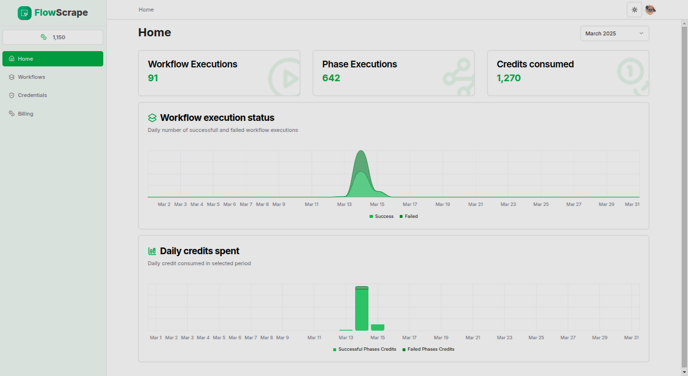
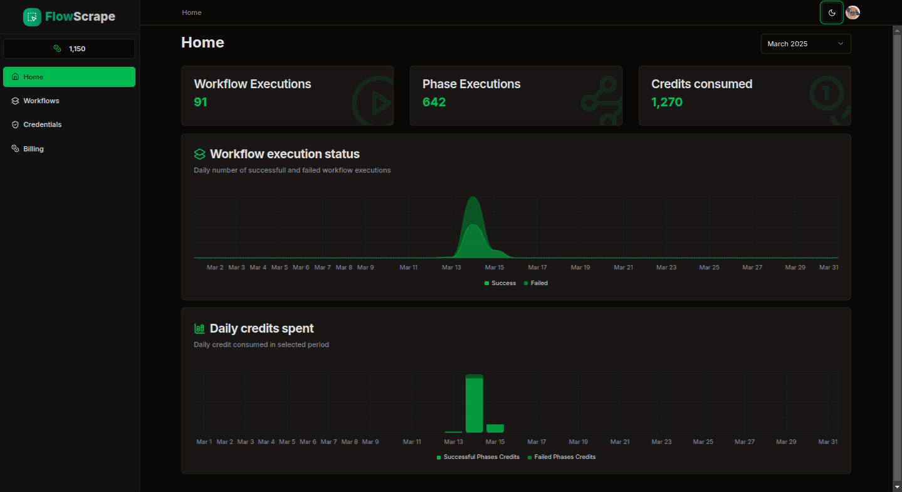

### Workflow Creation
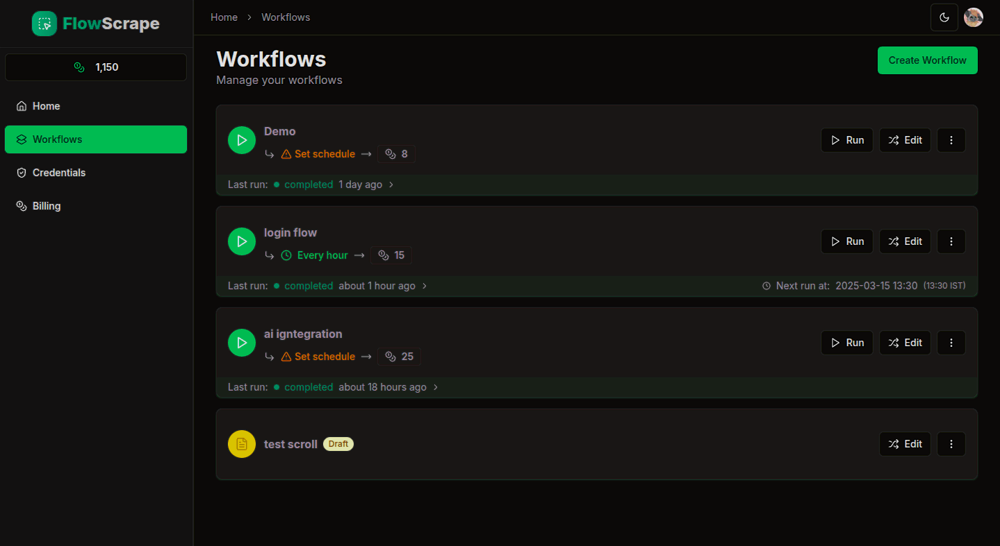
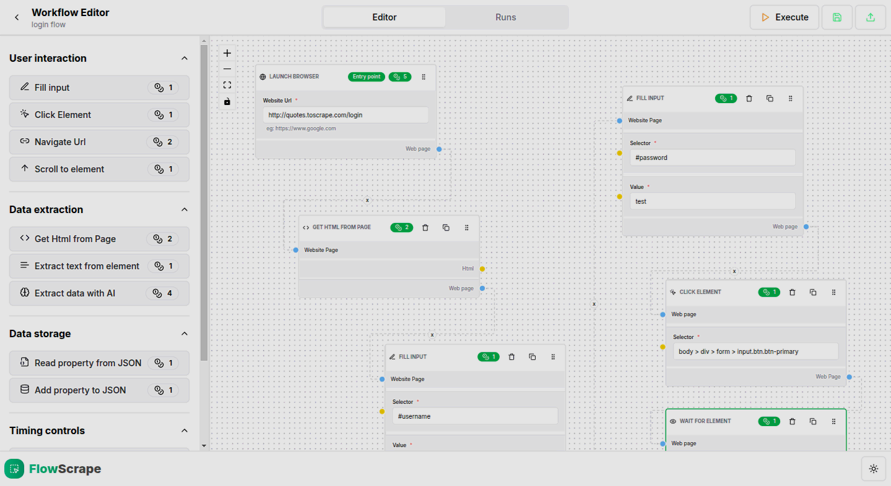
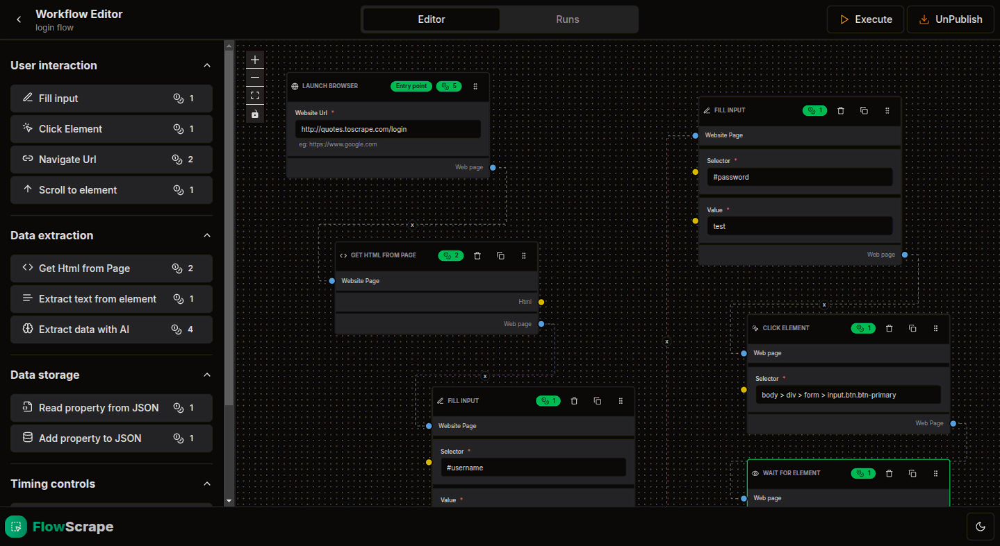

### Detailed Phase Information
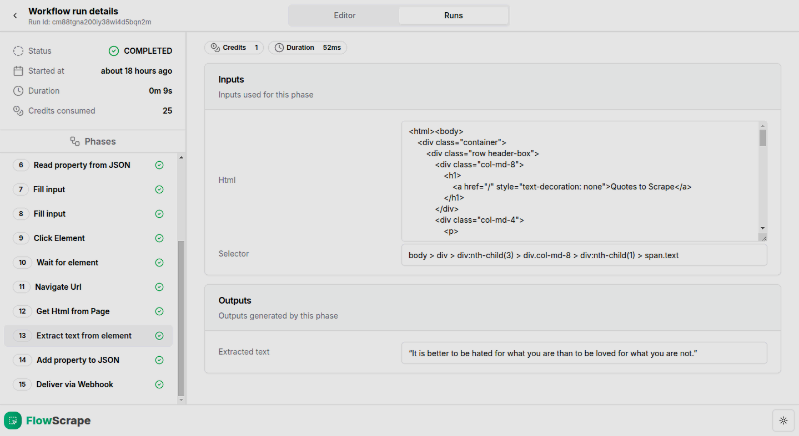

### AI-Powered Extraction
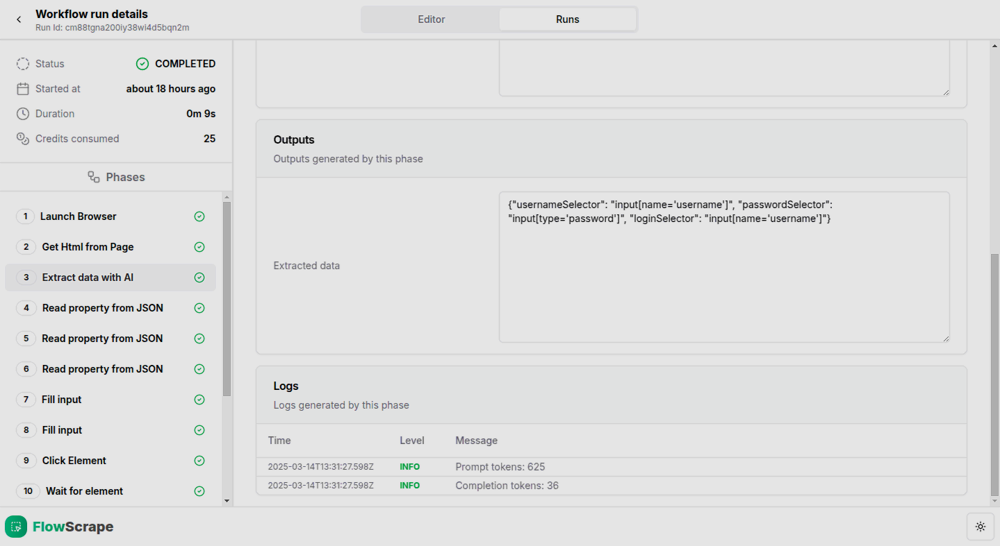

### Scheduling & Automation
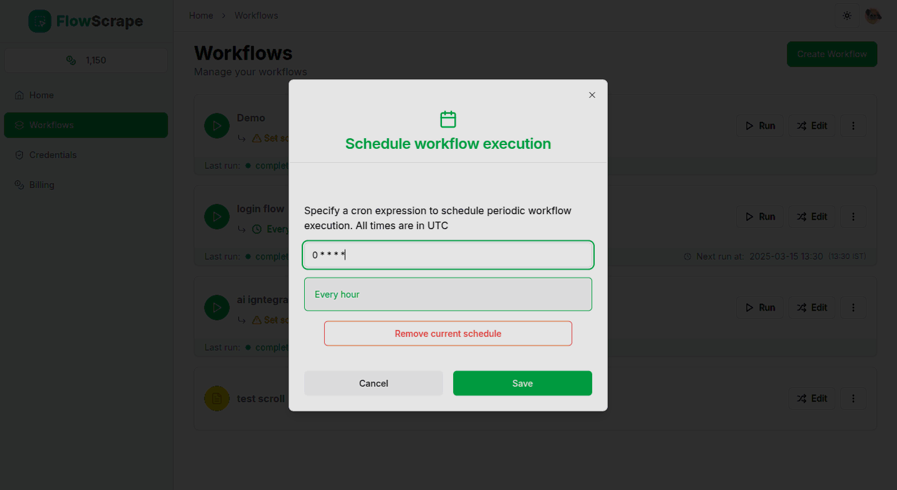
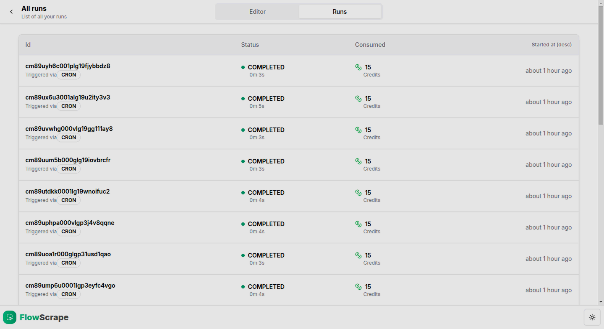

### Credentials & Access
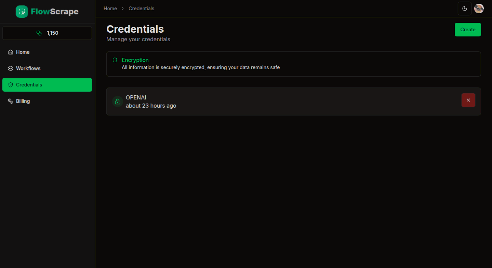
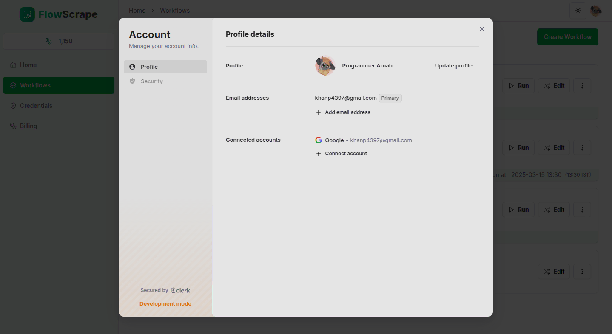

### Billing Views
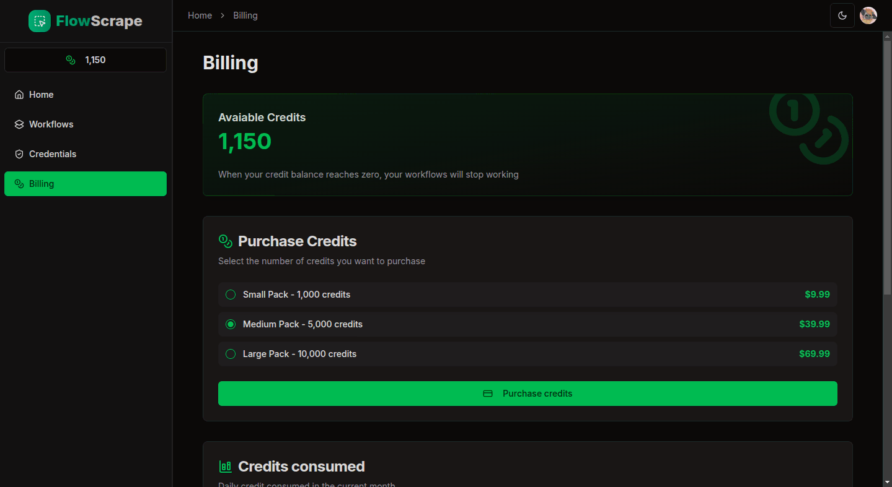
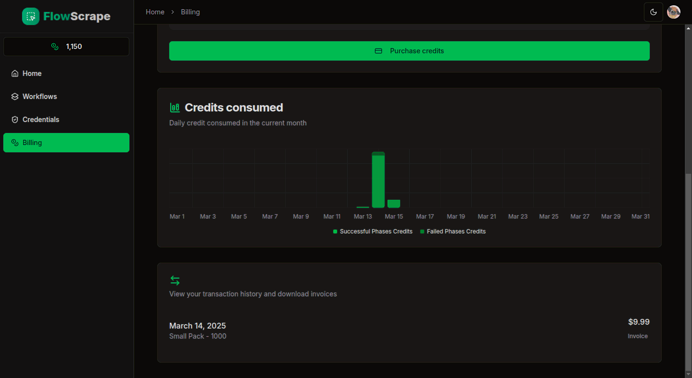

## Technologies Used

- Next.js 14 (with server actions)
- React Flow
- Sqlite DB (can switch to postgres if needed)
- Puppeteer
- Prisma
- [Live URL](http://188.245.106.30:4400)

## Key Features

- **Launch Browser:** Initializes a browser instance to start the scraping process.
- **Page to HTML:** Extracts complete HTML content from the web page.
- **Extract Text from Element:** Retrieves text content using specified CSS selectors.
- **Fill Input:** Emulates user input by automatically filling in form fields.
- **Click Element:** Simulates clicking on page elements for navigation or triggering events.
- **Scroll to Element:** Scrolls to specified page elements to support dynamic content loading.
- **Wait for Element:** Pauses operations until targeted elements appear or change.
- **Extract Data via AI:** Leverages AI to parse HTML and format data as JSON.
- **Read JSON & Build JSON:** Manages JSON objects by reading or dynamically updating their keys.
- **Deliver via Webhook:** Forwards scraped data to external endpoints via POST requests.
- **Navigate to URL:** Directs the browser to load the specified web page.

Flow Scrape is designed to streamline your web scraping needs with automation and flexibility. Enjoy building and managing your web scraping workflows with a modern, easy-to-use interface.

NOTE: Only for Desktop Users
Planning to work on Responsiveness Soon